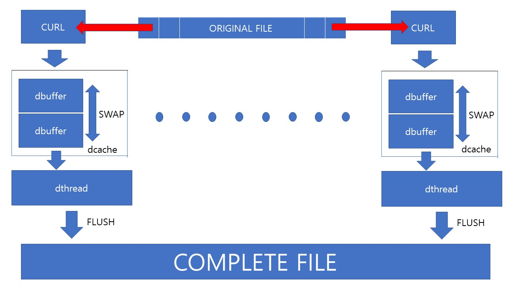
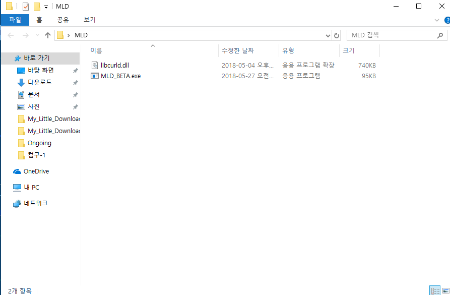
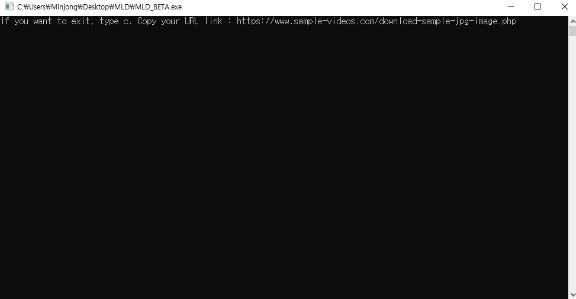
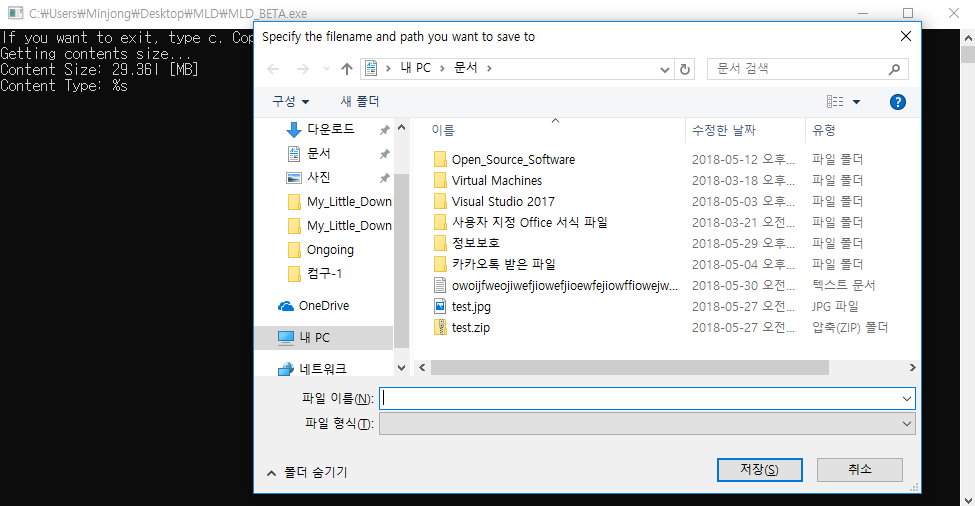
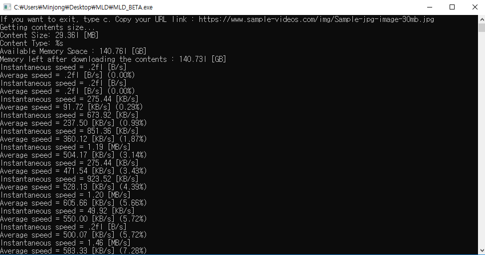
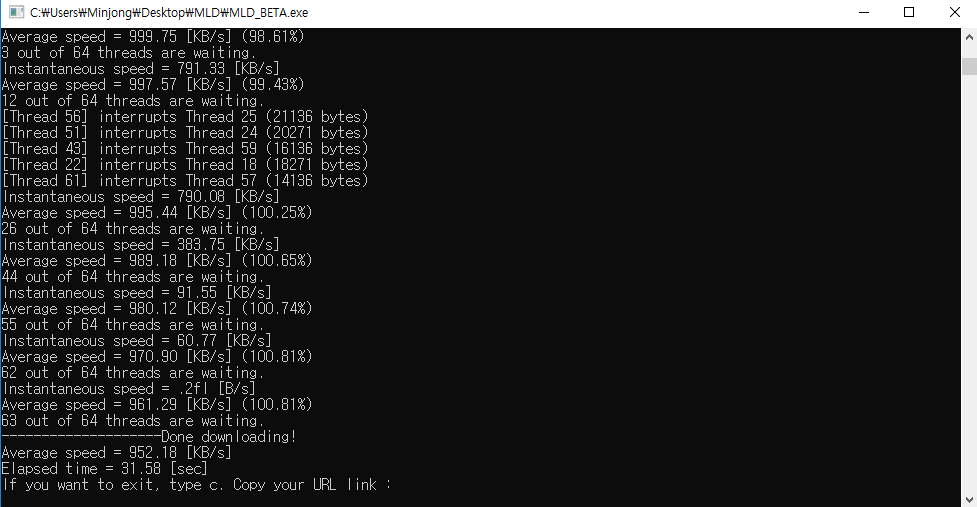
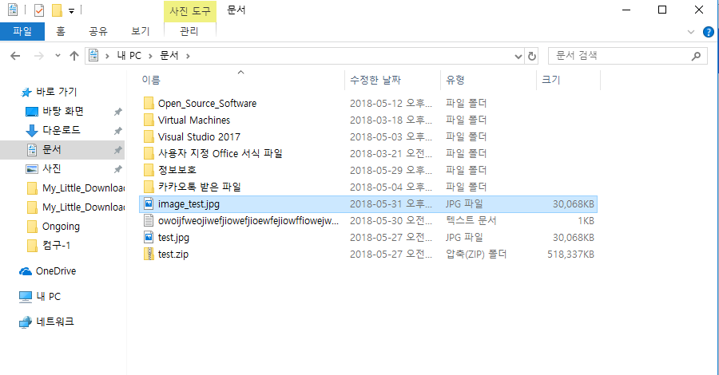
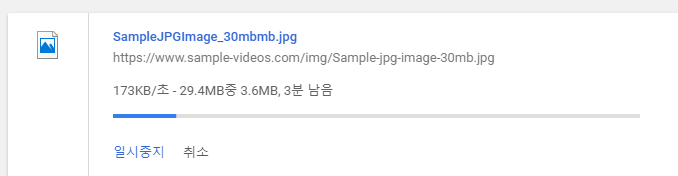
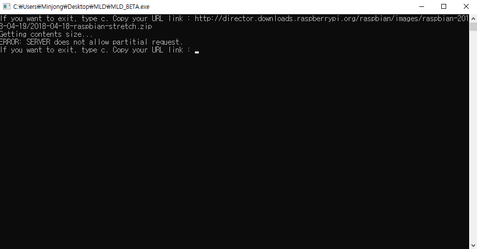

My Little Downloader  
=======================
 

## **INTRODUCE** 
My Little Downloader, 줄여서 MLD는 인터넷 환경이 좋지 못하거나 해외의 웹 서버에서 필요한 파일을 다운로드 하고자 할 때 너무 
많은 시간이 낭비되는 것을 막기 위하여 개발되었습니다. 하나의 컴퓨터에서 여러개의 스레드를 생성하고 각각의 스레드에 
원하는 파일을 분할하여 다운받은 뒤 이를 하나의 파일로 다시 합치는 과정을 거칩니다. 파일을 다운로드 하는 기능, 그리고 
파일을 분할하여 다운받는 기능을 구현하기 위해서 curl 오픈소스(7.59.0)를 활용하였습니다.  

MLD는 개발자들이 개발에 필요한 파일을 다운로드 해야 할 때 그 시간을 낭비하지 않도록 하는 것을 우선시 하였기 
때문에 다운로드 속도를 우선시하여 프로그램을 제작하였습니다. 따라서 RAM 용량이 충분치 않거나 CPU의 처리 능력이 부족할 경우, 
정상적인 작동이 이루어지지 않을 수 있습니다. 
현재 프로토타입에 해당되는 베타 버전의 MLD를 .exe 형태로 릴리즈 하였습니다.    

## **HOW MLD WORK?** 
[curl is used in command lines or scripts to transfer data. It is also used in cars, television sets, routers, printers, audio 
equipment, mobile phones, tablets, settop boxes, media players and is **the internet transfer backbone** for thousands of 
software 
applications affecting billions of humans daily.](https://curl.haxx.se/) - curl 공식 홈페이지의 설명  

MLD에서는 curl에서 제공해주는 기능 중 크게 2가지를 사용하였습니다. 
* curl이 제공하는 다운로드 기능 
* curl에서 웹 서버로부터 이어받기를 가능하게 해주도록 파일 포인터를 지정할 수 있게 해주는 기능   

MLD는 다음과 같은 방식으로 작동합니다. 우선 64개의 스레드를 생성합니다. 각각의 스레드 내에는 curl로부터 받은 데이터를 저장할 
캐시가 위치하고 이 캐시는 프론트버퍼와 백버퍼라는 두 개의 버퍼와 linked list로 구성되어 있습니다. 다운로드가 시작되면 curl은 
프론트버퍼에 다운받은 데이터를 전달해줍니다. 스레드는 일정한 주기로 프론트버퍼의 상태를 확인하고 프론트버퍼에 데이터가 있는 
것이 확인되면 백버퍼와 스왑하여 받아온 데이터를 flush하여 저장하고자 하는 경로에 하나의 파일로 통합합니다.(링크드리스트는 
두 개의 버퍼가 모두 가득차 있을 때를 위한 비상용 공간입니다) 이러한 방식으로 64개의 스레드가 각기 동작하며 일반적인 
다운로드보다 빠른 속도로 다운로드 하는 것을 가능케 해줍니다. 
만약 하나의 스레드에서 지정된 구간의 모든 파일을 다운받아 더 이상 수행할 작업이 없다면, 남은 스레드를 확인하여 다운로드할 
파일이 가장 많은 스레드의 데이터의 절반을 새롭게 다운받습니다.  

웹서버에 저장된 어떠한 파일을 일반적인 다운로드로 초당 300KB를 받는다면, 
**MLD를 사용할 경우 평균적으로 초당 5MB의 다운로드가 가능합니다.** 
(실험환경 RAM 8GB, CPU Intel i7 3770)    

## **HOW TO USE IT?** 
visual studio redistributable install required  

(https://www.sample-videos.com/download-sample-jpg-image.php) 으로부터 image 파일을 다운로드 하는 것을 예시로 
설명하겠습니다.  

 
My_Little_Downloader_BETA.zip을 다운로드하여 압축을 해제하면 다음과 같은 파일들이 있습니다. 
MLD_BETA.exe와 libcurld.dll을 같은 경로에 위치시킨 뒤에 프로그램을 실행시켜야 합니다.  

 
프로그램을 실행시키면 다음과 같은 창을 볼 수 있습니다. 여기서 c를 입력하고 엔터키를 누르면 프로그램이 종료됩니다.  

 
다운로드 하고자 하는 파일의 링크 주소를 복사하여 그대로 붙여넣습니다.  

 
링크를 입력한 뒤 엔터키를 누르면 어떤 경로에 어떤 이름으로 파일을 저장할 지를 설정해 줄 수 있도록 창이 나타납니다. 
(이곳에서는 image_test.jpg라는 이름으로 저장하였습니다.)  

 
다운로드 할 파일의 크기와 현재 지정된 경로에 남은 용량, 그리고 다운로드가 완료된 뒤의 남은 용량을 표시해주고 다운로드가 
시작됩니다. 순간 속도와 평균 속도가 표기됩니다.  

 
다운로드가 진행되면서 작업을 먼저 마친 thread가 있음을 "3 out of 64 threads are waiting"이라는 문구로 알려줍니다. 
할 일이 없어진 스레드들은 작업 중인 스레드들을 확인하여 가장 많은 데이터가 남은 스레드의 데이터를 절반 나누어 다운로드를 
진행하게 됩니다. 
다운로드를 완료하는데 걸린 시간은 31.98초 입니다.  

 
다운로드가 완료된 뒤 처음 설정해 두었던 경로로 가면 파일이 다운로드가 완료되었음을 확인할 수 있습니다.  

 
다운로드가 완료된 파일입니다. 분할 다운로드 후 통합이 정상적으로 이루어졌음을 이미지 파일을 통해 확인할 수 있습니다.  

 
일반적인 크롬 브라우저 다운로드로 같은 파일을 다운받았을 때입니다. 대략 3분 정도의 시간이 소요되었습니다.  

다운받고자 하는 파일의 크기가 크면 클 수록, 인터넷 속도가 좋지 않을 수록 더 큰 효과를 볼 수 있습니다.    

## **WHEN IT DOESN'T WORK?** 
MLD는 curl이 받아온 웹 서버의 status를 기반으로 작동합니다. 그렇기 때문에 웹 서버에서 이어서 다운로드 받을 수 있는 기능을 
비활성화 시켜놓은 경우에는 MLD를 다운 받을 수 없습니다.  

 
한 예로 라즈베리파이 홈페이지를 예로 들겠습니다. 현재 입력한 링크는 라즈베리파이의 [RASPBERRY STRETCH WITH 
DESKTOP](https://downloads.raspberrypi.org/raspbian_latest) 파일의 url 주소입니다. 웹서버에서 해당 기능을 지원하지 않도록 
설정해두었기 때문에 MLD는 작동하지 않습니다.    

## **LICENSE** 
**My_Little_Downloader 는 MIT/X License 하에 있습니다.**  
프로젝트에 사용한 curl 모듈 역시 MIT/X License 하에 있습니다. 
자세한 내용은 LICENSE 파일을 참조하세요.  
CURL - Curl and libcurl are licensed under a MIT/X derivate license, see below.
COPYRIGHT AND PERMISSION NOTICE
Copyright (c) 1996 - 2018, Daniel Stenberg, daniel@haxx.se, and many contributors, see the THANKS file.
All rights reserved.
Permission to use, copy, modify, and distribute this software for any purpose with or without fee is hereby 
granted, provided that the above copyright notice and this permission notice appear in all copies.
THE SOFTWARE IS PROVIDED "AS IS", WITHOUT WARRANTY OF ANY KIND, EXPRESS OR IMPLIED, INCLUDING BUT NOT LIMITED TO 
THE WARRANTIES OF MERCHANTABILITY, FITNESS FOR A PARTICULAR PURPOSE AND NONINFRINGEMENT OF THIRD PARTY RIGHTS. 
IN NO EVENT SHALL THE AUTHORS OR COPYRIGHT HOLDERS BE LIABLE FOR ANY CLAIM, DAMAGES OR OTHER LIABILITY, WHETHER 
IN AN ACTION OF CONTRACT, TORT OR OTHERWISE, ARISING FROM, OUT OF OR IN CONNECTION WITH THE SOFTWARE OR THE USE 
OR OTHER DEALINGS IN THE SOFTWARE.
Except as contained in this notice, the name of a copyright holder shall not be used in advertising or otherwise 
to promote the sale, use or other dealings in this Software without prior written authorization of the copyright 
holder.    

## **DEVELOPMENT ENVIRONMENT** 
My_Little_Downloader는 visual studio 2017에서 C언어를 기반으로 
제작되었습니다. 사용한 curl은 7.59.0 버전입니다. 소스 코드를 자세히 확인하고 싶으시면 PDF파일을 
참고하시길 바랍니다.    

## **SIMILAR PROJECT, PROGRAM** 
http://ugetdm.com/ - curl multithread download support, GPL 
https://github.com/rockdaboot/mget - GPLv3+, LGPLv3+ (C)  
https://github.com/daimajia/java-multithread-downloader - MIT (java) 
https://github.com/Aspsine/MultiThreadDownload - APACHE Version 2.0 (java, android application)  

위의 오픈소스 멀티스레드 다운로더들은 전체적으로 다양한 플랫폼과 환경에서 다운로드가 가능하도록 하기 위해서 
MLD보다 높은 효율성을 보이지는 못했습니다. 오픈소스가 아닌 다양한 멀티스레드 다운로더들 또한 마찬가지였으며 
이러한 closed source의 경우 프로그램 자체의 안전성에 대한 의심이 들었습니다.   

## **ISSUE** 
* 프로그램을 종료할 때 스레드가 사라지지 않고 계속 남아있는 경우 
* 다운로드가 진행하는 과정에서 갑작스럽게 RAM과 CPU 사용량이 증가하는 경우 
* 저장할 파일의 이름을 자동으로 생성해주는 기능이 작동하지 않음    

## **PROJECT MEMBER** 
201320934 하민종 – MLD 프로그램의 전체적인 구조와 작동 방식, thread 관련. 프로그램 코딩 
201320979 김현수 – cache 구조와 이벤트 핸들링. Catcha와 simpleHTTPServer Korean 프로그램 코딩    

  **질문이나 하고 싶은 말이 있으시다면 hamj1128@ajou.ac.kr 
또는 terra1006@ajou.ac.kr로 연락해주시기 바랍니다.**   
